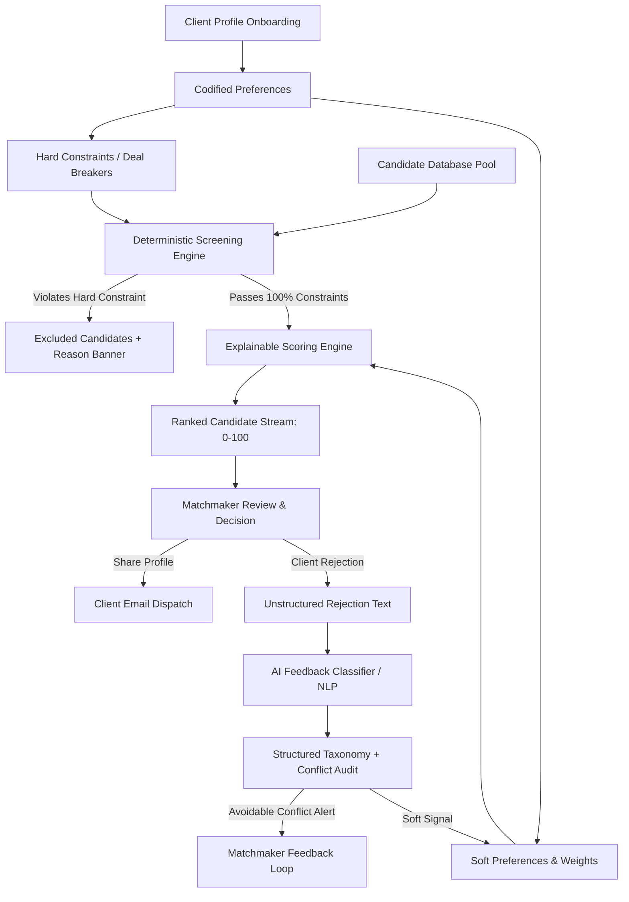

# The Date Crew — Preference-Aware Matchmaking Assistant

> **Product & Tech Generalist Assessment Deliverable**  
> Built for **The Date Crew**

---

## Overview

At **The Date Crew**, human matchmakers curate romantic introductions for clients. However, the last 30-day funnel data revealed critical operational leaks:
1. **690 out of 1,000 shared profiles are rejected** at Stage 1 (a 69% drop-off).
2. **~35% of those rejections (~241 profiles)** fail on criteria the client had *already explicitly specified* in their profile (e.g., smoking habits, location, children, age).
3. **Matchmakers spend ~2 hours per client per week** manually searching database pools.
4. **Huge variance in matchmaker outcomes:** Matchmaker A achieves **44%** acceptance while Matchmaker B achieves only **21%**.
5. **Rejection feedback is trapped in unstructured free text**, preventing systematic improvements.

Instead of building an opaque "AI black-box" to predict love, we built the **Preference-Aware Matchmaking Assistant**: a **decision-support tool** that eliminates avoidable preference violations, automates tedious manual filtering, and surfaces transparent compatibility rankings—keeping the human matchmaker firmly in control.

---

## Product Hypothesis

> If we automatically filter candidates against hard deal-breakers and rank the remainder using transparent, weighted compatibility scoring, we will:
> 1. Reduce the **Preference-Conflict Rejection Rate** from **35% to below 18%**.
> 2. Reduce **Matchmaker Search Time** from **2.0 hours to 1.2–1.5 hours** per client/week.
> 3. Standardize curation quality across all matchmakers, elevating lower performers toward Matchmaker A's 44% benchmark.

---

## Key Features

1. **Preference Separation & Normalization**  
   Distinguishes non-negotiable **Hard Deal Breakers** (smoking, drinking, children, age range, metro geography) from **Soft Preferences** (career, education, lifestyle alignment).
2. **Automated Constraint Screening & Exclusion**  
   Evaluates candidate pools instantly. Profiles violating any hard deal breaker are marked `Excluded` with prominent warning tags explaining the exact conflict.
3. **Explainable Compatibility Scoring (0–100)**  
   Eligible candidates receive an additive score with full transparency. Clicking *"Why this profile?"* displays exact factor contributions (+25 Location, +20 Age, +20 Industry, +20 Lifestyle, +10 Education).
4. **AI-Assisted Rejection Feedback Classifier**  
   Extracts standardized taxonomies and confidence scores from qualitative free-text feedback (e.g., *"I liked her but she smokes socially"* → `Smoking Habit Conflict`, 96% confidence). Automatically alerts matchmakers when an avoidable preference conflict slipped through.
5. **Pilot KPI & Funnel Metrics Dashboard**  
   Visualizes the full 30-day conversion funnel and benchmarks proposed pilot targets against company baselines.

---

## Tech Stack

- **Framework:** React 19, TypeScript
- **Bundler & Tooling:** Vite, Vitest
- **Styling:** Custom Vanilla CSS Design System (modern typography: Outfit & Plus Jakarta Sans, glassmorphism, responsive grid)
- **Icons:** Lucide React
- **Architecture Pattern:** Pure functional deterministic core + lightweight NLP parsing

---

## System Architecture



---

## Running Locally

### Prerequisites
- Node.js (v18+ recommended; tested on v24.13.0)
- npm (v9+)

### Installation & Execution

1. **Clone the repository:**
   ```bash
   git clone <YOUR_REPO_URL>
   cd the-date-crew-assessment
   ```

2. **Install dependencies:**
   ```bash
   npm install
   ```

3. **Run automated unit tests:**
   ```bash
   npm test
   ```
   *(Runs 8 automated unit tests verifying constraint exclusions, additive scoring, and AI feedback parsing in <1s)*

4. **Launch the local development server:**
   ```bash
   npm run dev
   ```
   Open [http://localhost:5173](http://localhost:5173) in your browser.

5. **Build for production:**
   ```bash
   npm run build
   ```

---

## Testing & Verification

Automated test suite located in `tests/scoring.test.ts` covers:
- Exclusion of candidates violating smoking deal breakers.
- Exclusion of candidates violating age boundaries.
- Exclusion of candidates violating children/family planning rules.
- Additive scoring and recommendation flags for top matches.
- Natural language classification of rejection reasons (smoking, location, demanding career).
- Avoidable conflict detection against client profiles.

---

## Assumptions

1. **Data Availability:** Assumes clients complete a standard intake questionnaire that captures basic deal-breakers (smoking, children, age, location).
2. **Matchmaker Curation Role:** Matchmakers continue to craft personalized intro emails; technology serves as a screening and ranking copilot, not an autonomous sender.
3. **Funnel Independence:** Assumes the 30-day funnel reflects steady-state organic operations and that email is the primary profile delivery mechanism.

---

## Prototype Limitations

1. **Mock Data:** Client and candidate pools are realistic synthetic datasets designed to illustrate the matching challenge.
2. **Mock AI Engine:** The feedback classifier uses a deterministic semantic taxonomy matcher rather than live LLM API calls, ensuring 100% reliable local evaluation without external API keys or network latency.
3. **No Auth/Database:** State is managed locally in React memory for the demonstration.

---

## Future Improvements

1. **Learning-to-Rank (LTR):** Train lightweight logistic regression or ranking models on historical acceptances/rejections to dynamically tune soft preference weights per client.
2. **Automated Two-Way Scheduling Integration:** Address Stage 4 drop-off (150 chats → 75 meetings fixed) via calendar-syncing integrations (e.g., Cal.com).
3. **Email Draft Generator:** Generative AI assistant to draft bespoke introduction blurbs highlighting shared compatibility points.
4. **Revealed Preference Diagnostics:** Alert matchmakers when a client's rejection behavior contradicts their stated onboarding preferences.
